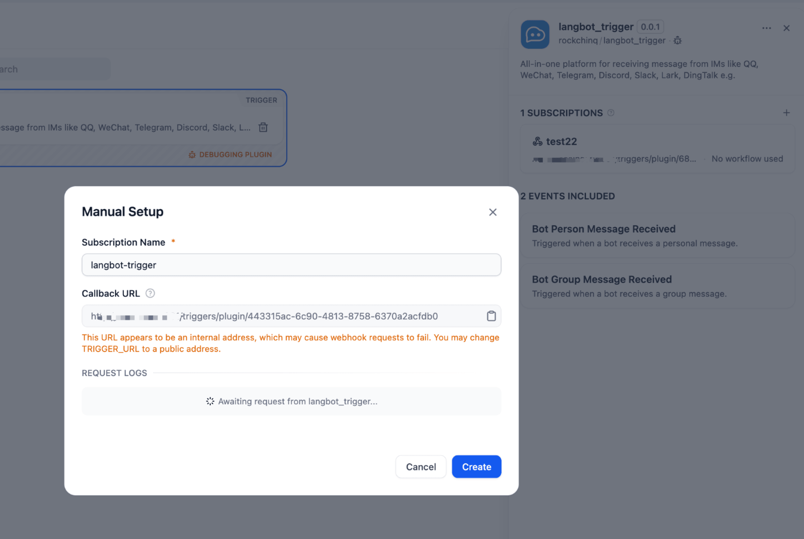
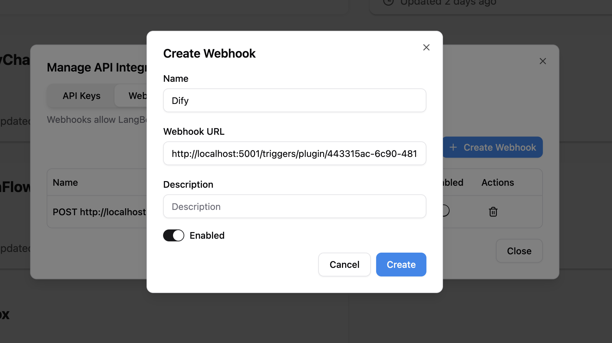
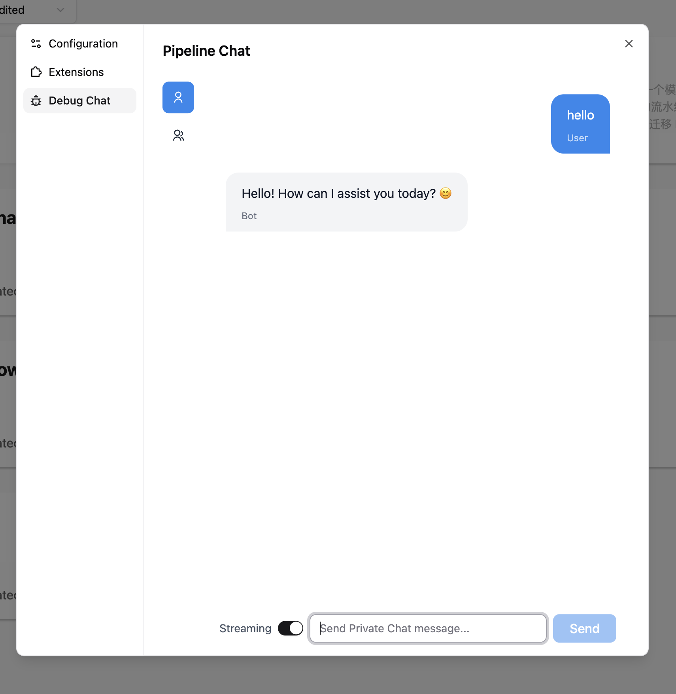
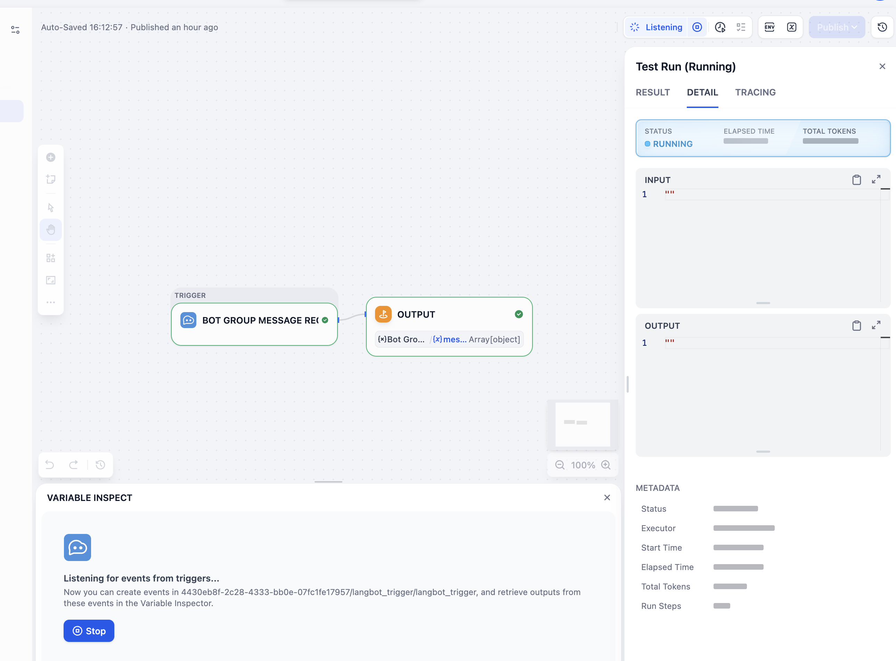

## langbot_trigger

[LangBot](https://github.com/langbot-app/LangBot) is an open-source LLM native instant messaging robot development platform, aiming to provide out-of-the-box IM robot development experience, with Agent, RAG, MCP and other LLM application functions, adapting to global instant messaging platforms, and providing rich API interfaces, supporting custom development.

This trigger plugin is used to process message events from LangBot Webhook. It can be used to trigger Dify workflows when a message is received from a LangBot instance.

## Usage

1. Install this plugin in Dify.
2. Setup LangBot instance according to the [LangBot documentation](https://docs.langbot.app/en/insight/guide.html).
3. Open subscription page in Dify, copy the Webhook URL.

4. Go back to LangBot API integration page, fill in the Webhook URL and save the configuration.

5. Receive messages from configured bots, or test it in LangBot pipeline debug page.

> If you wang to receive messages from other platforms(e.g. Telegram, Discord, Slack, LINE, Lark, DingTalk), you should configure your bots according to the [LangBot documentation](https://docs.langbot.app/en/deploy/platforms/readme.html).

6. You can now use this plugin to trigger Dify workflows when a message is received from a LangBot instance.

